<div align="center">

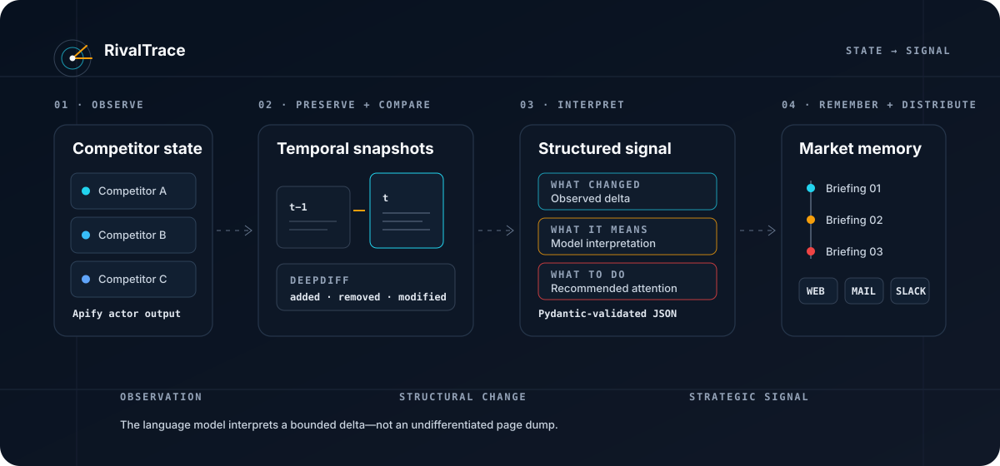

# RivalTrace

### AI Competitive Intelligence & Market Signal Monitoring

Capture competitor state, isolate meaningful change, preserve the history, and turn bounded deltas into structured strategic intelligence.

[Architecture](#system-architecture) · [Signal pipeline](#signal-lifecycle) · [API](#api-surface) · [Technical specifications](#technical-specifications) · [Quickstart](#local-quickstart)


[](LICENSE)

</div>

<p align="center">
  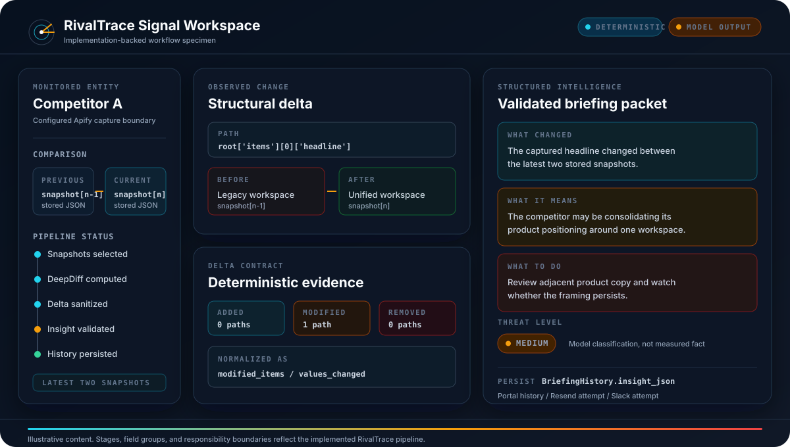
</p>

<p align="center"><sub>Implementation-backed product view — actual pipeline stages and schema boundaries with clearly illustrative content.</sub></p>

---

## Contents

- [How RivalTrace works](#how-rivaltrace-works)
- [Why RivalTrace](#why-rivaltrace)
- [From noise to signal](#from-noise-to-signal)
- [Core capabilities](#core-capabilities)
- [System architecture](#system-architecture)
- [Signal lifecycle](#signal-lifecycle)
- [Temporal model](#temporal-model)
- [Delta engine](#delta-engine)
- [Sanitization boundary](#sanitization-boundary)
- [AI interpretation](#ai-interpretation)
- [Evidence and inference](#evidence-and-inference)
- [Market memory and delivery](#market-memory-and-delivery)
- [Data architecture](#data-architecture)
- [Trust boundaries](#trust-boundaries)
- [Operations and failure behavior](#operations-and-failure-behavior)
- [API surface](#api-surface)
- [Technical specifications](#technical-specifications)
- [Testing](#what-the-test-suite-protects)
- [Deployment](#deployment-model)
- [Quickstart](#local-quickstart)
- [Design principles](#design-principles)

---

## How RivalTrace works

One briefing run follows a bounded pipeline:

1. Load active clients and their tracked competitors.
2. Select the two newest snapshots for each competitor.
3. Establish a baseline when only one snapshot exists.
4. Compare previous and current JSON state with DeepDiff.
5. Normalize dictionary, iterable, value, and type changes into `added_items`, `removed_items`, and `modified_items`.
6. Stop when the normalized delta is empty.
7. Strip HTML, remove empty values, flatten nested paths, and bound the analysis input.
8. Ask Claude to interpret the sanitized delta—not the full historical page state.
9. Validate the response against the `CompetitorInsight` Pydantic schema.
10. Persist generated intelligence as `BriefingHistory`.
11. Render an HTML briefing and attempt delivery through Resend and, when configured, a Slack incoming webhook.
12. Expose persisted briefings through the Next.js portal.

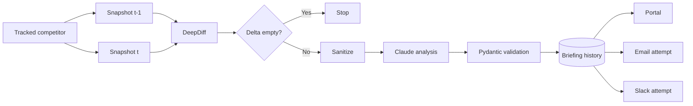

> **Mental model:** RivalTrace treats competitive intelligence as a temporal data problem before treating it as a language-model problem.

---

## Why RivalTrace

A competitor page is an observation—not intelligence. A changed DOM node is a signal candidate—not a strategic conclusion. An LLM summary is an interpretation—not evidence.

Useful competitive intelligence needs several distinct objects:

| Layer          | Question                                        | RivalTrace mechanism                                                  |
| -------------- | ----------------------------------------------- | --------------------------------------------------------------------- |
| State          | What did the source contain at a point in time? | Timestamped `Snapshot.raw_data`                                       |
| Change         | What differs from the prior state?              | DeepDiff over the latest two snapshots                                |
| Boundary       | What bounded input may reach the model?         | HTML stripping, empty-value removal, path flattening, character limit |
| Interpretation | What might the change mean?                     | Schema-constrained Claude response                                    |
| Memory         | What intelligence was generated, and when?      | `BriefingHistory.insight_json`                                        |
| Distribution   | Where should the briefing appear?               | Portal, Resend adapter, Slack webhook adapter                         |

RivalTrace therefore keeps deterministic observation mechanics upstream of probabilistic interpretation:

> **State first. Diff second. Interpretation third. Distribution last.**

---

## From noise to signal

The model should analyze the change—not the entire noisy universe around it.

```text
RAW COMPETITOR STATE       ██████████████████████████████
                                  │ snapshot comparison
                                  ▼
STRUCTURAL CHANGE          ████████████
                                  │ clean + flatten + bound
                                  ▼
SANITIZED DELTA            ████████
                                  │ structured interpretation
                                  ▼
STRATEGIC SIGNAL           ████
```

<sub>Conceptual information reduction; bars do not represent measured percentages.</sub>

The reduction is architectural:

- Equivalent snapshots never invoke strategic analysis in the briefing pipeline.
- DeepDiff isolates structural changes before the model is called.
- The sanitizer removes markup and empty branches, then flattens useful paths.
- Pydantic rejects model output that does not match the intelligence contract.

---

## Core capabilities

| Capability                 | Implemented mechanism                                                      | Why it exists                                                                     |
| -------------------------- | -------------------------------------------------------------------------- | --------------------------------------------------------------------------------- |
| Competitor registry        | Client-owned `Competitor` records with website URL and Apify actor ID      | Defines what is observed and which capture actor owns extraction                  |
| Snapshot capture           | Apify actor invocation followed by JSON snapshot persistence               | Preserves competitor state independently of later interpretation                  |
| Temporal comparison        | Latest-snapshot lookup and DeepDiff comparison                             | Makes change—not a standalone page—the unit of analysis                           |
| Delta normalization        | Added, removed, and modified semantic groups                               | Gives downstream analysis a stable change vocabulary                              |
| No-change fast path        | Empty deltas stop before Claude invocation                                 | Reduces noise and avoids unnecessary model calls                                  |
| Sanitized model input      | HTML removal, empty pruning, flattening, 15,000-character default bound    | Narrows untrusted external content before analysis                                |
| Structured intelligence    | `CompetitorInsight` with summary, three insight sections, and threat level | Converts model prose into a validated application contract                        |
| Briefing memory            | JSON/JSONB-backed `BriefingHistory`                                        | Keeps intelligence available beyond a transient notification                      |
| Channel adapters           | Jinja email template + Resend; Slack Block Kit + incoming webhook          | Separates intelligence generation from communication channels                     |
| Client portal              | Overview, competitors, briefing list/detail, and settings surfaces         | Makes persisted competitive state inspectable in a web interface                  |
| External trigger boundary  | HMAC-compared webhook secret for n8n-compatible trigger routes             | Lets an external scheduler initiate a run without embedding scheduling in the API |
| Structured operations logs | Structlog with JSON rendering in production mode                           | Adds client and competitor context to orchestration events                        |

---

## System architecture

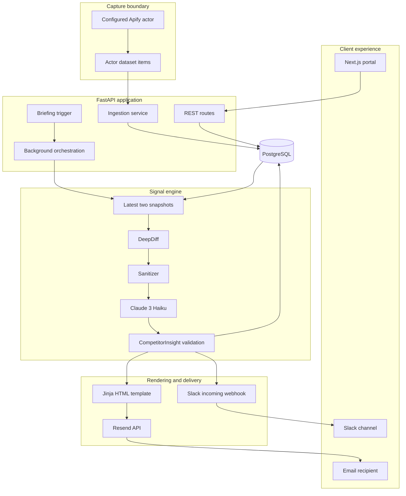

### Control path vs. signal path

| Control path                                                       | Signal path                                                           |
| ------------------------------------------------------------------ | --------------------------------------------------------------------- |
| Clients define competitors and delivery configuration.             | Apify results become immutable-in-practice timestamped snapshot rows. |
| An API call or authenticated-secret webhook starts a briefing run. | The newest state is compared with the preceding state.                |
| FastAPI `BackgroundTasks` executes the in-process workload.        | Only non-empty deltas cross the sanitization and model boundary.      |
| Portal routes read competitor and briefing records.                | Validated insights are persisted and passed to delivery adapters.     |

The repository does not embed a calendar scheduler or durable queue. The `/weekly-briefings` naming describes the briefing cadence and template; invocation is explicit or supplied by an external automation system.

---

## Signal lifecycle

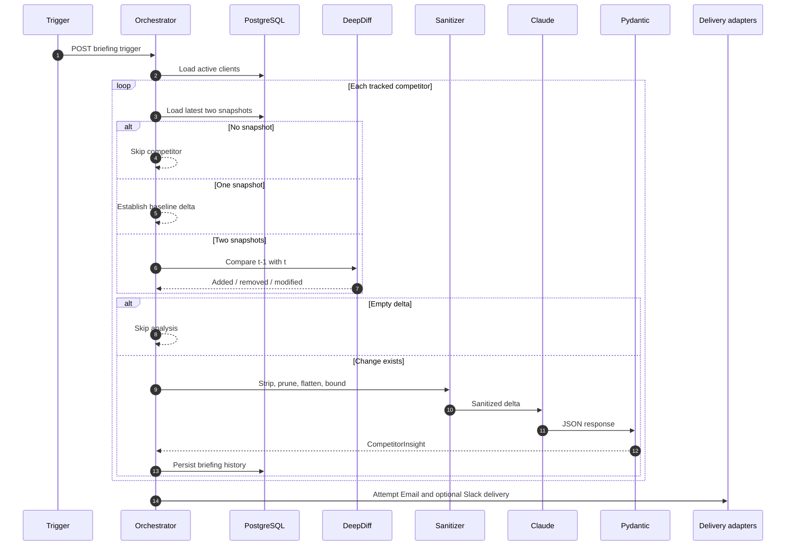

The model never decides whether the raw snapshots differ. That decision belongs to deterministic application logic.

---

## Temporal model

RivalTrace analyzes `STATE(t-1)` against `STATE(t)`. The resulting object is a competitor delta:

```text
Δcompetitor = DeepDiff(snapshot[t-1].raw_data, snapshot[t].raw_data)
```

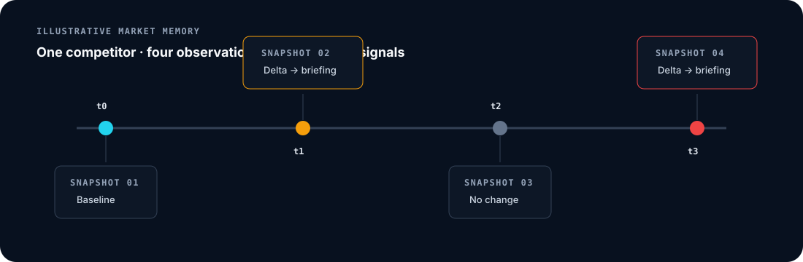

### Snapshot architecture

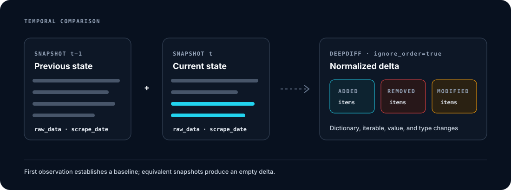

Each `Snapshot` belongs to one competitor and stores:

- `competitor_id`
- `scrape_date`
- `raw_data`
- `created_at`

`raw_data` uses SQLAlchemy JSON for SQLite compatibility and maps through the PostgreSQL deployment path. Briefing insight payloads explicitly use a PostgreSQL JSONB variant.

### Baseline semantics

When no earlier snapshot exists, `calculate_delta` places the first captured payload under `added_items`. This establishes an initial comparison baseline; it should not be read as evidence that the competitor just introduced every observed element.

---

## Delta engine

DeepDiff runs with `ignore_order=True` and `report_repetition=True`. RivalTrace maps its output into three stable groups:

| RivalTrace group | DeepDiff categories consumed                       | Meaning                                                        |
| ---------------- | -------------------------------------------------- | -------------------------------------------------------------- |
| `added_items`    | `dictionary_item_added`, `iterable_item_added`     | Paths or iterable entries present only in the current snapshot |
| `removed_items`  | `dictionary_item_removed`, `iterable_item_removed` | Paths or iterable entries absent from the current snapshot     |
| `modified_items` | `values_changed`, `type_changes`                   | Values or value types that differ across snapshots             |

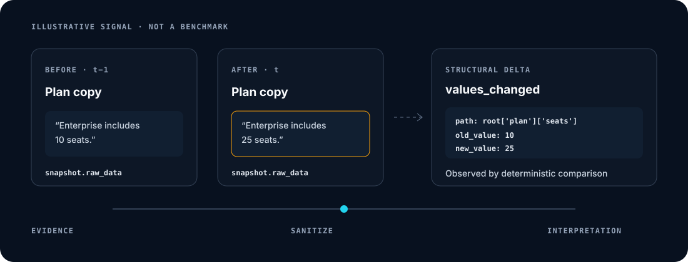

### No-change fast path

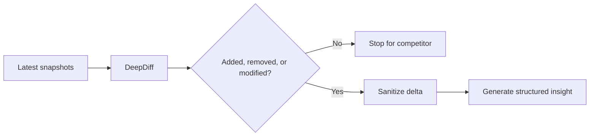

The direct insight endpoint returns a `LOW`-threat, empty-section “No changes detected” response. The multi-client briefing orchestrator skips the competitor entirely, so no briefing item or model call is produced for that comparison.

---

## Sanitization boundary

Scraped competitor material is untrusted external input. RivalTrace narrows it before model analysis:

`untrusted JSON → structural delta → remove empty values → strip HTML → flatten paths → apply character bound → analysis input`

The default model-input bound is 15,000 characters. When exceeded, the sanitizer truncates the flattened text and appends an explicit truncation marker.

This is a content-reduction boundary, not a claim of prompt-injection immunity. It removes markup and noise; it does not implement semantic injection detection.

---

## AI interpretation

The analysis adapter calls `claude-3-haiku-20240307` with the sanitized delta and requires JSON matching `CompetitorInsight`.

```json
{
  "executive_summary": "A short summary of the most important observed shift.",
  "what_changed": [
    {
      "category": "Product",
      "description": "A factual description derived from the supplied delta."
    }
  ],
  "what_it_means": [
    {
      "category": "Strategy",
      "description": "A model-generated interpretation of that observation."
    }
  ],
  "what_to_do": [
    {
      "category": "Monitor",
      "description": "A model-generated recommendation for attention."
    }
  ],
  "threat_level": "MEDIUM"
}
```

<sub>Illustrative values; field names and enum values match the implemented Pydantic schema.</sub>

### Deterministic code vs. model responsibility

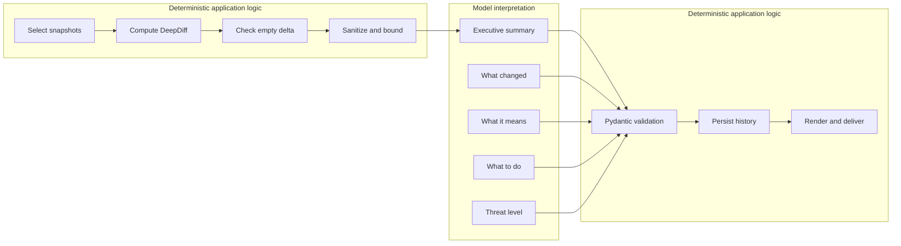

Claude calls use exponential-backoff retry with at most three attempts. If analysis remains unavailable, the adapter returns a schema-valid fallback with an availability message, `LOW` threat, and empty insight sections; the briefing orchestrator does not persist empty-section fallbacks.

---

## Evidence and inference

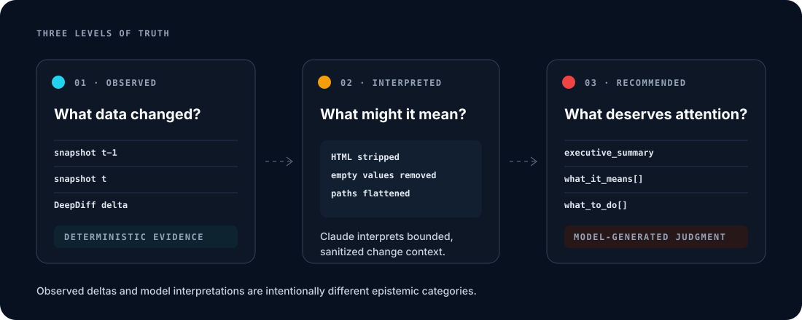

| Level       | Origin                                           | Epistemic status                                             |
| ----------- | ------------------------------------------------ | ------------------------------------------------------------ |
| Observed    | Two stored snapshots plus deterministic DeepDiff | Reproducible structural difference over captured JSON        |
| Interpreted | Claude over sanitized delta                      | Model-generated explanation that may require human review    |
| Recommended | Claude within `what_to_do`                       | Model-generated action guidance, not an autonomous operation |

Threat severity is also model-produced (`LOW`, `MEDIUM`, or `HIGH`). It is a bounded classification in the output contract, not a deterministic risk score.

---

## Market memory and delivery

A briefing without history is a notification. Persisted snapshots and structured briefing records create a chronological market memory that the portal can retrieve.

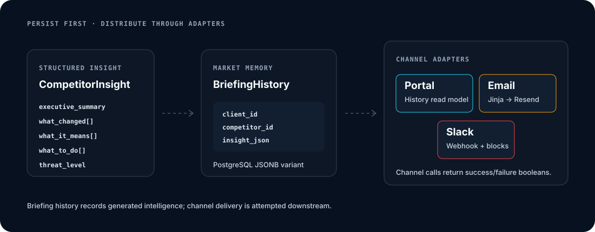

### Briefing generation

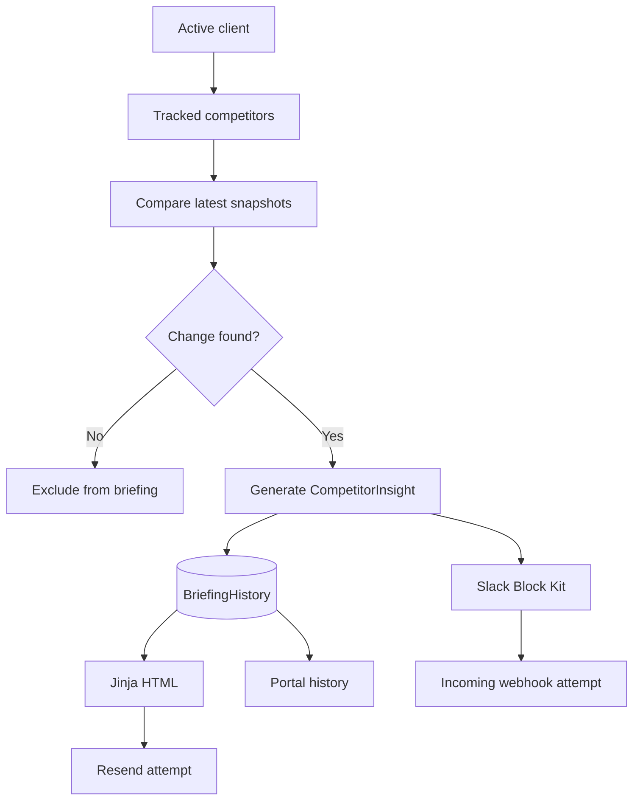

`BriefingHistory` stores the client, competitor, scrape timestamp, structured insight JSON, and a delivery-status enum. Current orchestration creates the history record before attempting channel delivery, so the README treats this record as generated-intelligence history—not as proof of provider-confirmed delivery.

##…342 tokens truncated…     |
| Briefing detail | Separates “What Changed,” “What It Means,” and “What To Do” into inspectable sections                           |
| Settings        | Presents Slack delivery and subscription configuration controls                                                 |

---

## Data architecture

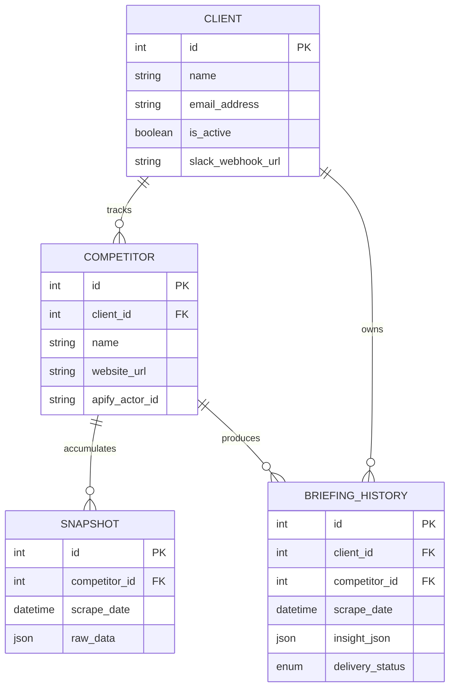

### Persistence decisions

- Relational keys encode client → competitor → observation/briefing ownership.
- Snapshot JSON preserves actor-specific result shapes without forcing one universal webpage schema.
- Timestamps make competitor state orderable for latest-two comparison.
- Briefing JSON stores the complete validated insight contract independently of email or Slack rendering.
- Alembic maintains the four-model schema across PostgreSQL deployments.

---

## Trust boundaries

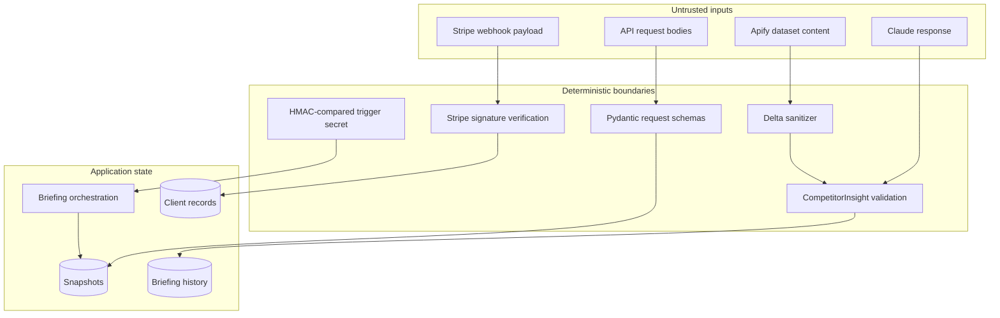

### Implemented controls

| Surface                    | Control                                                                               |
| -------------------------- | ------------------------------------------------------------------------------------- |
| External briefing triggers | Required `X-Webhook-Secret`, compared with `hmac.compare_digest`                      |
| Portal credentials         | Bcrypt password verification through Passlib                                          |
| Portal session handoff     | Expiring HS256 JWT returned by FastAPI and stored in NextAuth’s JWT session           |
| Request contracts          | Pydantic models for clients, competitors, Apify input, deltas, and insight output     |
| Scraped content            | Structural diff followed by HTML stripping, empty pruning, flattening, and truncation |
| Model output               | JSON parsing followed by `CompetitorInsight` validation                               |
| Stripe events              | Provider signature verification before subscription-state mutation                    |
| Secrets                    | Read from environment-backed settings rather than embedded API keys                   |

The codebase does not claim that the sanitizer is a complete prompt-injection defense. It establishes a narrower input boundary and leaves strategic interpretation explicitly model-generated.

---

## Operations and failure behavior

| Condition                              | Implemented behavior                                                                                        |
| -------------------------------------- | ----------------------------------------------------------------------------------------------------------- |
| Apify call raises                      | Retry up to three attempts with exponential wait; adapter logs failure and returns an empty `items` payload |
| Competitor has no snapshots            | Briefing orchestration skips that competitor                                                                |
| Competitor has one snapshot            | Entire snapshot becomes the initial `added_items` baseline                                                  |
| Latest states are equivalent           | Briefing orchestration skips Claude and produces no briefing item                                           |
| Claude is rate-limited or fails        | Retry up to three attempts; return a schema-valid empty fallback after exhaustion                           |
| Generated insight contains no sections | Orchestrator does not append or persist it                                                                  |
| Slack is unconfigured                  | Slack attempt is skipped; email path remains independent                                                    |
| Slack or email returns failure         | Failure is logged; processing continues                                                                     |

### Structured logging

Structlog adds logger name, level, ISO timestamp, stack/exception formatting, and Unicode handling. Development uses readable console output; production mode renders JSON. The orchestration path binds `client_id`, `client_name`, `competitor_id`, and `competitor_name` to relevant events.

---

## API surface

FastAPI exposes interactive OpenAPI documentation at `http://localhost:8000/docs` when the backend is running.

### Capture a competitor snapshot

```bash
curl -X POST "http://localhost:8000/api/v1/ingest/42" \
  -H "Content-Type: application/json" \
  -d '{
    "startUrls": [
      { "url": "https://example.com" }
    ]
  }'
```

The configured competitor supplies the Apify actor ID. `ApifyRunInput` permits additional actor-specific fields, so the exact payload follows that actor’s contract.

### Generate an insight from stored snapshots

```bash
curl -X POST "http://localhost:8000/api/v1/insights/generate/42"
```

### Start a multi-client briefing run

```bash
curl -X POST "http://localhost:8000/api/v1/orchestrate/weekly-briefings"
```

The endpoint returns HTTP `202` and schedules work through FastAPI `BackgroundTasks`. Execution is in-process; the endpoint is not a durable workflow queue.

### Trigger through the external-automation boundary

```bash
curl -X POST "http://localhost:8000/api/v1/webhooks/n8n/trigger-all" \
  -H "X-Webhook-Secret: ${WEBHOOK_SECRET}"
```

The repository also implements a per-client trigger at `POST /api/v1/webhooks/n8n/trigger-client/{client_id}`.

<details>
<summary><strong>Additional route groups</strong></summary>

| Prefix                | Purpose                                              |
| --------------------- | ---------------------------------------------------- |
| `/api/v1/auth`        | Client credential login and JWT issuance             |
| `/api/v1/clients`     | Client CRUD                                          |
| `/api/v1/competitors` | Competitor CRUD                                      |
| `/api/v1/dashboard`   | Briefing history and client-owned competitor actions |
| `/api/v1/billing`     | Stripe Checkout creation and signed webhook handling |

</details>

---

## Technical specifications

<details open>
<summary><strong>Monitoring and delta engine</strong></summary>

| Specification        | Current implementation                                                   |
| -------------------- | ------------------------------------------------------------------------ |
| Tracked entity       | Competitor with website URL and configured Apify actor ID                |
| Capture provider     | Apify Python API client                                                  |
| Capture result       | Actor dataset items wrapped as `{"items": [...]}`                        |
| Snapshot timestamp   | UTC `scrape_date` plus `created_at`                                      |
| Comparison window    | Most recent snapshot for ingestion; newest two for insight/orchestration |
| Diff library         | DeepDiff                                                                 |
| Order semantics      | List order ignored; repetition reporting enabled                         |
| Added categories     | Dictionary and iterable additions                                        |
| Removed categories   | Dictionary and iterable removals                                         |
| Modified categories  | Value and type changes                                                   |
| Empty-delta behavior | No model call in briefing orchestration                                  |
| First observation    | Full current payload placed in `added_items`                             |

</details>

<details>
<summary><strong>AI analysis and persistence</strong></summary>

| Specification           | Current implementation                                                             |
| ----------------------- | ---------------------------------------------------------------------------------- |
| Analysis provider       | Anthropic SDK                                                                      |
| Model identifier        | `claude-3-haiku-20240307`                                                          |
| Input                   | Sanitized, flattened structural delta                                              |
| Default input bound     | 15,000 characters                                                                  |
| Output validation       | Pydantic `CompetitorInsight`                                                       |
| Output sections         | `executive_summary`, `what_changed`, `what_it_means`, `what_to_do`, `threat_level` |
| Severity enum           | `LOW`, `MEDIUM`, `HIGH`                                                            |
| Retry                   | Three attempts with exponential wait                                               |
| Database                | PostgreSQL 15 in Docker Compose; SQLite-compatible development default             |
| ORM / migrations        | SQLAlchemy + Alembic                                                               |
| Snapshot representation | SQLAlchemy JSON                                                                    |
| Insight history         | JSON with PostgreSQL JSONB variant                                                 |

</details>

<details>
<summary><strong>Delivery, orchestration, and portal</strong></summary>

| Specification         | Current implementation                                             |
| --------------------- | ------------------------------------------------------------------ |
| Email renderer        | Jinja2 HTML template                                               |
| Email provider        | Resend                                                             |
| Slack method          | Client-specific incoming webhook via Slack SDK                     |
| Slack format          | Block Kit                                                          |
| Portal history        | Briefing list and detail pages over `BriefingHistory`              |
| API framework         | FastAPI                                                            |
| Background mechanism  | In-process FastAPI `BackgroundTasks`                               |
| Trigger routes        | Direct orchestration plus secret-protected n8n-compatible webhooks |
| Frontend              | Next.js 16.2.10, React 19.2.4, Tailwind CSS 4                      |
| Client data           | TanStack Query + Axios                                             |
| Portal authentication | NextAuth credentials provider backed by FastAPI login              |

</details>

<details>
<summary><strong>Infrastructure and runtime</strong></summary>

| Specification       | Current implementation                                               |
| ------------------- | -------------------------------------------------------------------- |
| Backend runtime     | Python 3.11                                                          |
| Frontend CI runtime | Node.js 20                                                           |
| Containers          | Multi-stage backend Dockerfile                                       |
| Local services      | FastAPI application + PostgreSQL 15                                  |
| Backend port        | `8000`                                                               |
| Frontend port       | `3000`                                                               |
| CI                  | Ruff syntax/undefined-name checks, pytest, frontend production build |
| License             | MIT                                                                  |

</details>

---

## What the test suite protects

The repository contains six focused pytest cases around the deterministic core:

- HTML is stripped from analysis input.
- Empty strings, collections, and `None` values are removed.
- Oversized flattened input is truncated with an explicit marker.
- Nested dictionaries and lists produce stable flattened paths.
- A first capture becomes an `added_items` baseline.
- A later capture identifies added and removed structural content.

CI also runs a targeted Ruff check and builds the Next.js frontend with Node.js 20.

```bash
python -m pytest
cd frontend && npm run build
```

---

## Deployment model

Docker Compose provisions the FastAPI backend and PostgreSQL 15. The frontend runs from `frontend/` as a separate Next.js process and reaches FastAPI through `NEXT_PUBLIC_API_URL`. Apify, Anthropic, Resend, Slack, and Stripe remain external provider boundaries configured through environment values.

---

## Local quickstart

### 1. Clone and configure

```bash
git clone https://github.com/arslanvuzmal/RivalTrace.git
cd RivalTrace
cp .env.example .env
```

Set strong local values for `WEBHOOK_SECRET` and `JWT_SECRET_KEY`, then add the provider credentials required by the path you intend to exercise.

### 2. Start the backend and database

```bash
docker compose up --build -d
docker compose exec app alembic upgrade head
```

- API: `http://localhost:8000`
- OpenAPI: `http://localhost:8000/docs`
- PostgreSQL: `localhost:5432`

### 3. Start the client portal

```bash
cd frontend
npm install
NEXT_PUBLIC_API_URL=http://localhost:8000 npm run dev
```

The portal is available at `http://localhost:3000`. Portal login expects an existing client record with a bcrypt `password_hash`.

<details>
<summary><strong>Environment reference</strong></summary>

| Variable                          | Used by                                  |
| --------------------------------- | ---------------------------------------- |
| `ENVIRONMENT`                     | Logging mode and application settings    |
| `DATABASE_URL`                    | SQLAlchemy and Alembic                   |
| `APIFY_API_TOKEN`                 | Apify actor execution                    |
| `ANTHROPIC_API_KEY`               | Claude analysis                          |
| `RESEND_API_KEY`                  | Email delivery                           |
| `FROM_EMAIL`                      | Resend sender identity                   |
| `WEBHOOK_SECRET`                  | External briefing-trigger authentication |
| `LOG_LEVEL`                       | Python/Structlog verbosity               |
| `JWT_SECRET_KEY`                  | FastAPI access-token signing             |
| `JWT_ALGORITHM`                   | JWT signing algorithm; default `HS256`   |
| `JWT_ACCESS_TOKEN_EXPIRE_MINUTES` | Access-token lifetime; default 60        |
| `STRIPE_SECRET_KEY`               | Checkout API                             |
| `STRIPE_WEBHOOK_SECRET`           | Stripe event verification                |
| `STRIPE_PRICE_ID`                 | Subscription line item                   |
| `NEXT_PUBLIC_API_URL`             | Next.js API client base URL              |

</details>

---

## Repository structure

```text
RivalTrace/
├── app/
│   ├── api/v1/              # ingestion, insights, orchestration, portal, auth
│   ├── core/                # settings, database, logging, webhook security
│   ├── models/              # client, competitor, snapshot, briefing history
│   ├── schemas/             # API and strategic-insight contracts
│   ├── services/            # Apify, DeepDiff, sanitizer, Claude, delivery
│   └── templates/           # Jinja briefing email
├── frontend/
│   └── src/
│       ├── app/             # login, dashboard, competitors, briefings, settings
│       ├── components/      # portal layout and UI primitives
│       └── lib/             # API and NextAuth integration
├── alembic/                 # relational schema migrations
├── assets/                  # checked-in product screenshot
├── docs/readme-assets/      # README-only technical illustrations
├── tests/                   # delta and sanitizer invariants
├── Dockerfile
└── docker-compose.yml
```

---

## Design principles

1. **State before interpretation.** A competitor must have a captured state before meaningful change can be measured.
2. **Diff before LLM.** Deterministic structural comparison isolates change before probabilistic analysis begins.
3. **No change means no analysis.** Equivalent snapshots do not deserve a synthetic briefing item.
4. **External content crosses a boundary.** Scraped material is stripped, pruned, flattened, and bounded before model use.
5. **Observation and interpretation are different objects.** A structural delta is reproducible evidence; strategy and severity are model judgments.
6. **Structured output beats unbounded prose.** Pydantic turns the model response into a typed intelligence contract.
7. **Intelligence outlives its channel.** Persisted briefing history remains available independently of email and Slack attempts.
8. **History creates market memory.** Timestamped snapshots and briefing records preserve how a monitored competitor evolved.
9. **Channels remain adapters.** Portal, email, and Slack consume intelligence; they do not define it.
10. **Scheduling remains explicit.** External automation may trigger the pipeline, while execution semantics remain visible in the FastAPI service.

### Operational invariants

| Invariant                                      | Why it exists                                                     |
| ---------------------------------------------- | ----------------------------------------------------------------- |
| Only active clients enter the multi-client run | Bounds orchestration scope                                        |
| Snapshots are ordered by `scrape_date`         | Preserves temporal comparison semantics                           |
| Empty delta skips the model                    | Prevents noise and unnecessary analysis calls                     |
| Sanitization precedes Claude                   | Narrows the untrusted-content boundary                            |
| Insight output must validate                   | Keeps downstream persistence and rendering typed                  |
| Briefing history precedes channel attempts     | Keeps generated intelligence independent of its distribution path |

---

## License and author

RivalTrace is available under the [MIT License](LICENSE).

Built and maintained by [Arslan Vuzmal](https://github.com/arslanvuzmal).

